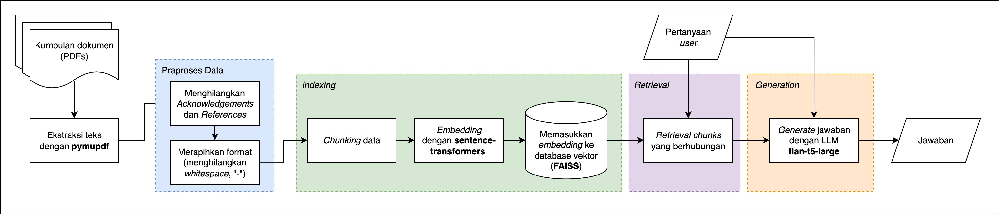
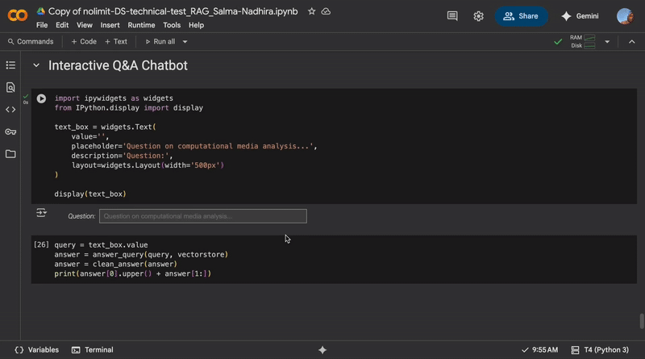

# RAG Chatbot

### Q&A Chatbot untuk menjawab pertanyaan seputar *computational media analysis*

Dataset merupakan 30 *file* dalam format **PDF** (60,5 MB) yang dikumpulkan mandiri secara manual berupa jurnal, buku, dan artikel dalam Bahasa Inggris seputar analisis media secara komputasional seperti analisis *framing*, deteksi berita palsu, dan deteksi propaganda menggunakan metode komputasional seperti *deep learning* dan pemodelan topik.

## Flowchart

Tuning pada beberapa parameter dan model dilakukan untuk menemukan embedding parameter yang menghasilkan jawaban terbaik, yang didokumentasikan melalui [log iterasi](https://docs.google.com/spreadsheets/d/1fvNhsdH15O83DG2wBWyW-Ziuv8HC-XclSvzU3IECP48/edit?usp=sharing).

## ⚙️ Tech Stack

**PDF Extraction & Preprocess:** 
- `PyMuPDF`
- `Re`

**Embedding Model:**
- `LangChain`, `HuggingFaceEmbeddings`
- `sentence-transformers/all-mpnet-base-v2`

**Embedding Model:**
- `FAISS`

**Large Language Model (LLM):**
- `google/flan-t5-large`

## 📙 Menjalankan dengan [Google Colab](https://colab.research.google.com/drive/1EsHIbeDpwCz_GL9gZOdVpnw9S5NC809c?usp=sharing)
Terdapat input box pada bagian bawah notebook untuk memasukkan pertanyaan.

## 🔄 Deployment dengan [HuggingFace Spaces](https://huggingface.co/spaces/salmdanu/nolimit-ds-test-salmanadhirad) dan [Streamlit Cloud](https://nolimit-ds-test-salmanadhira.streamlit.app/)
Deployment RAG pada HuggingFace Spaces dan Streamlit Cloud telah diusahakan, namun belum berhasil menjalankan chatbot dengan sempurna. Beberapa kendala yang dialami sebagai berikut:
- ⚠️ Keterbatasan CPU sehingga model dengan daya komputasi besar (`flan-t5-large`) tidak dapat dijalankan dengan baik dan tidak di-support oleh Inference Providers
- ⚠️ Terjadinya **AssertionError** yang disebabkan oleh perbedaan dimensi dengan embedding dan indeks FAISS (hal ini kemungkinan disebabkan oleh pembuatan FAISS yang dilakukan terpisah (di Colab, untuk memaksimalkan GPU) namun terjadi perubahan saat deployment)
  
## 💡 Saran Perbaikan
- Praproses data yang lebih menyeluruh untuk menangani variasi format pada jurnal (terdapatnya header, footer, dsb.)
- Augmentasi query untuk menangani pertanyaan yang mungkin kurang jelas (karena menggunakan natural language)
- Perbaikan prompt untuk mendukung jawaban yang lebih berkualitas
